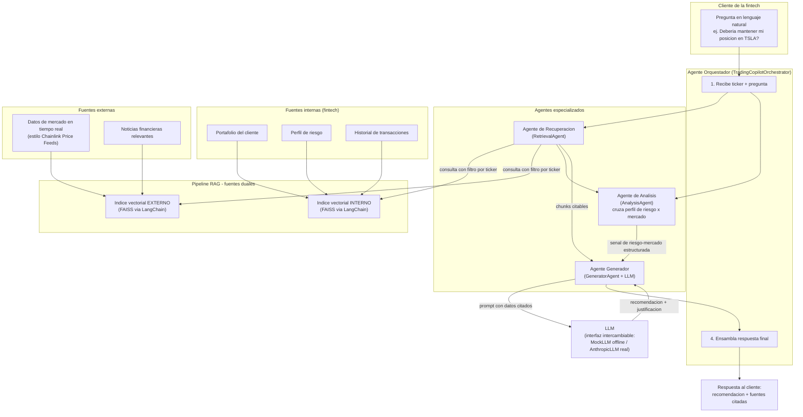

# Arquitectura de la solucion

## Diagrama de componentes

## Componentes clave y su integracion

1. **Agente Orquestador** (`insight_trader/agents/orchestrator.py`): punto de entrada unico. Recibe `(ticker, pregunta)`, coordina la secuencia recuperacion -> analisis -> generacion, y devuelve un objeto `CopilotResponse` con la recomendacion y toda la evidencia usada (trazabilidad).

2. **Agente de Recuperacion** (`retrieval_agent.py`): construye las consultas para el pipeline RAG y obtiene chunks relevantes de ambas fuentes (interna y externa), filtrando siempre por el ticker consultado para evitar contaminacion cruzada entre activos.

3. **Pipeline RAG de fuentes duales** (`rag/retriever.py`, `rag/vector_store.py`, `rag/embeddings.py`): dos indices vectoriales independientes (interno/externo) construidos con FAISS a traves de LangChain. La recuperacion es hibrida: filtra candidatos por metadata (ticker) y luego ordena por similitud semantica, evitando que el LLM reciba datos de un activo distinto al consultado.

4. **Agente de Analisis** (`analysis_agent.py`): logica determinista que cruza el perfil de riesgo del cliente (tolerancia a drawdown) con las condiciones de mercado del activo (volatilidad, tendencia) y el sentimiento de noticias, produciendo una senal estructurada (`RiskMarketSignal`).

5. **Agente Generador** (`generator_agent.py`): ensambla el prompt final (ver `docs/prompts.md`) combinando los chunks recuperados y la senal de analisis, y delega la redaccion de la recomendacion en lenguaje natural al LLM.

6. **Interfaz de LLM intercambiable** (`llm.py`): `MockLLM` (offline, determinista, usada en las pruebas de esta entrega) y `AnthropicLLM` (real, activable con `INSIGHT_TRADER_LLM_PROVIDER=anthropic` y `ANTHROPIC_API_KEY`), ambas implementando el mismo contrato `generate(prompt) -> str`.

## Flujo de datos (resumen)

`Pregunta del cliente -> Orquestador -> Recuperacion (RAG dual) -> Analisis (riesgo x mercado) -> Generacion (LLM con datos citados) -> Respuesta explicable`
